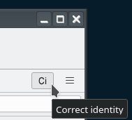
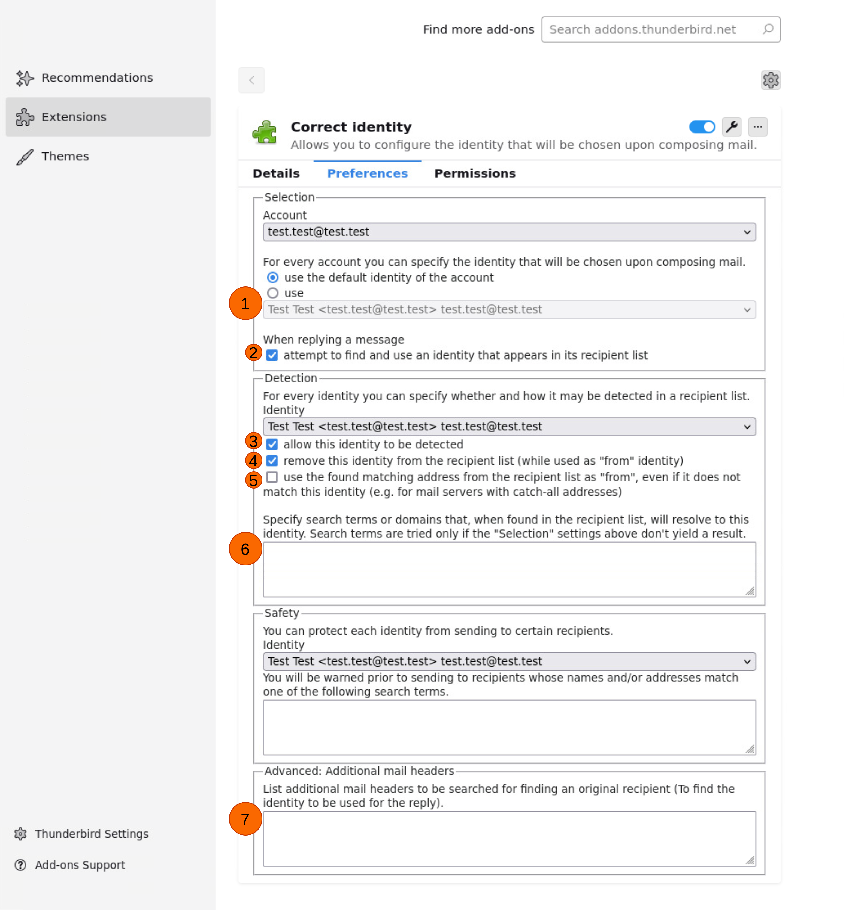
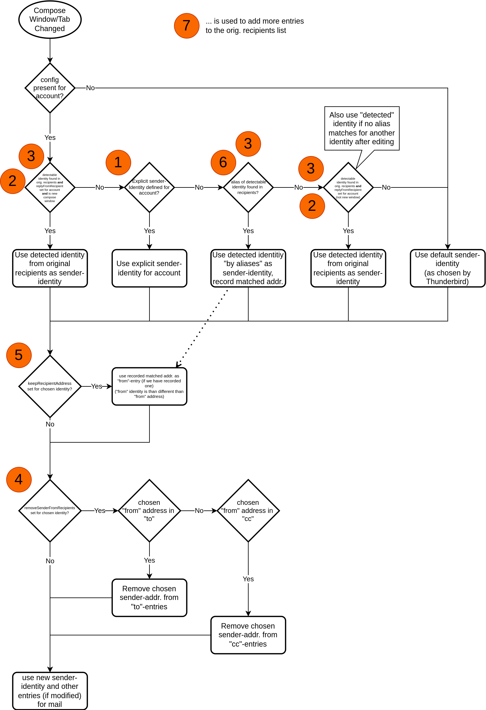

Thunderbird Add-on "Correct Identity" (v2.6.x)
==============================================

This add-on version works with Thunderbird versions >= 115.0
(Tested up to version 137)

Version Support History:  
Version v2.5.3 supports Thunderbird version >= 102.0  
Version v2.3.2 supports Thunderbird version >= 91.0  
Version v2.0.1 supports Thunderbird version >= 78.0  

It's a **perfect alternative/continuation**

- of the original (version 1.x.x) Correct Identity
- to [Flexible Identity](https://github.com/snakelizzard/flexible_identity)

which don't work anymore because Thunderbird switched to new Plugin API
framework called [WebExtension](https://webextension-api.thunderbird.net/).

Check also the built-in features of Thunderbird which also evolve over time.

The add-on comes in 5 different languages. Here is a screenshot of the settings
window:

Using Correct Identity
----------------------

This add-on helps to always use the correct "from" email identity when replying to messages or composing new messages.

The configuration reflects the Thunderbird concept of "accounts" and "identities":

* accounts: are the mailboxes where emails arrive and associated servers used to send emails
* identities: are the email addresses available for composing emails. Typically the main email address of the accounts plus the configured aliases. Each identity is bound to a specific account.

The typical configurations use lists of "regular expressions". In the simplest from this could be complete email addresses or parts of email addresses.

Features
--------

* Choose the initial "from" identity when composing a new email
* Choose the "from" identity when replying to a message
    * based on the original recipients of the replied-to message
    * **NEW in 2.4.x:** based on addressbook entries
    * **NEW in 2.5.1:** based on mailinglist entries
    * based on non-standard SMTP header fields of the replied-to message (**new feature**: "Advanced: Additional mail headers")
    * **NEW in 2.5.x:** use any matched address as "from" to support "catch-all" mail server configurations
* Automatically change the "from" identity when addressing specific recipients
* Warn if specific recipients are included in a email send from a specific identity

### **NEW in 2.5.x:** Use matching address as "from"
In mail servers with "catch-all" configuration, all mails with any destination email address received by that server are forwarded to a single mailbox. E.g. \*@mailbox.test with "\*" being any local part of the address. 

Examples: `info@mailbox.test, unknown.user@mailbox.test, some.random.address@mailbox.test` etc.

Correct identity addon allows to use that address as "from" when replying such an email. E.g. use "mailbox.test" as detection search pattern and choose "use the found ... as from" option.
In this use case, the "from" email-address is different from the selected sender identity. If you like to keep your sender identity hidden from the final mail recipients, please check if your mail server does not leak that information in the outgoing emails (e.g. by checking the "source" view of a received sample email).

### **NEW in 2.4.x:** Addressbook Match
Instead of using individual match entries, also a complete addressbook can be checked for a match.
As an example you can add the following line to the text field:  
addressbook="My Private Address Book"

The string in quotes is the name of the address book as given in the
address book pane. Can be copied from address book properties.

### **NEW in 2.5.1:** Mailinglist Match
Similar to the Addressbook Match, also a complete mailinglist can be checked for a match.
As an example you can add the following line to the text field:  
mailinglist="My Mailing List"

The string in quotes is the name of the mailinglist.
Mailinglists are defined within addressbooks. The add-on looks into all addressbooks and checks contacts from all matching mailinglists. (But Thunderbird may prevent creating a mailinglist with the same name in a different addressbook)

### Advanced: Additional mail headers
[Email header fields](https://en.wikipedia.org/wiki/Email#Header_fields) are keywords in the SMTP (Simple Mail Transfer Protocol) message. E.g. "**To**" identifies the email recipient.
Beyond those standard headers, some email providers use vendor-specific headers e.g. to identify the original recipient of a forwarded message. Some known headers are:

* Received
* Delivered-To
* X-Delivered-to
* X-Apparently-To
* X-Resolved-to
* X-Mail-from

To check if your email provider uses such a header field to transport an address you are interested in, browse the source of the message (e.g. Ctrl+U in Thunderbird message view).
Add the found header name (optionally with an occurrence index) to the configuration.
E.g. Received#3 uses the third "received:" header line to find a potential match.

The found header lines are prepended to the normal "recipients" e.g. from "To:" and used to find
a matching "from" identity. The first match is taken. So the sequence of the header fields in the configuration defines the search priority.
Header fields that are not present in the mail are ignored.

Configuration Shortcut
----------------------

When this add-on is installed, a small icon "Ci" appears in the Thunderbird toolbar.
This icon provides a shortcut to the add-on configuration page.

Installation
------------
The github repository [dennisverspuij/tb-correctidentity](https://github.com/dennisverspuij/tb-correctidentity) holds the latest (development) version of the add-on.
The version available at [Thunderbird Add-ons site](https://addons.thunderbird.net/de/thunderbird/addon/correct-identity/) will be updated regularly.

Steps for installation (local build):
1. Download this repository
2. In the repository folder, execute `./make_xpi.sh` to create an .xpi file
4. Open Thunderbird, go to /Add-ons/, and click /Install add-on from file/
5. Choose the .xpi file in the repository folder

The .xpi files come in two flavors:
* correct_identity_vX.Y.Z.xpi is a version which could (in theory) be released to the [official Thunderbird add-on store](https://addons.thunderbird.net/)
* correct_identity_vX.Y.Z_dev.xpi has the same content, but has no limitation on the highest supported Thunderbird version ("strict_max_version"). Use this version to test this add-on on newer Thunderbird versions not known at date of the add-on release. (Feedback welcome).

The add-on can now be configured in the add-on manager tab.

Alternatively you can directly download an .xpi file from the "Releases" section.

Development & Contributing
--------------------------

1. Fork this repo and download it with `git pull`
2. Call `./make_xpi.sh` in the repo
3. In Thunderbird, Menu /Extras/ → /Development Tools/ → /Debug Add-ons/
4. /Load temporary Add-on/ and select the .xpi file
5. Then you can press /Reload/
6. …
7. Send us a pull request!

Note that you have to generate a .xpi file *with the same name* whenever you change the source code. You can use a file watcher like inotify to automate this.

In Menu /Extras/ → /Development Tools/ you'll also find a dev console and more debugging tools.

Flowchart
---------

The configuration options are sometimes confusing. A more formal description of the detection mechanism can be found in the flowchart below. But first we "label" the configuration options in the config page.

Flow diagram to determine the final "from" identity and email-address:

Acknowledgment
--------------

Many thanks to @dennisverspuij, the original author , and to @ldreier who ported this add-on to Thunderbird 67!

Trivia
------

Before this fork:

[Here is the old version](https://addons.thunderbird.net/de/thunderbird/addon/correct-identity/versions/1.4.7)
of Correct Identity which doesn't work on Thunderbird versions > 67.
