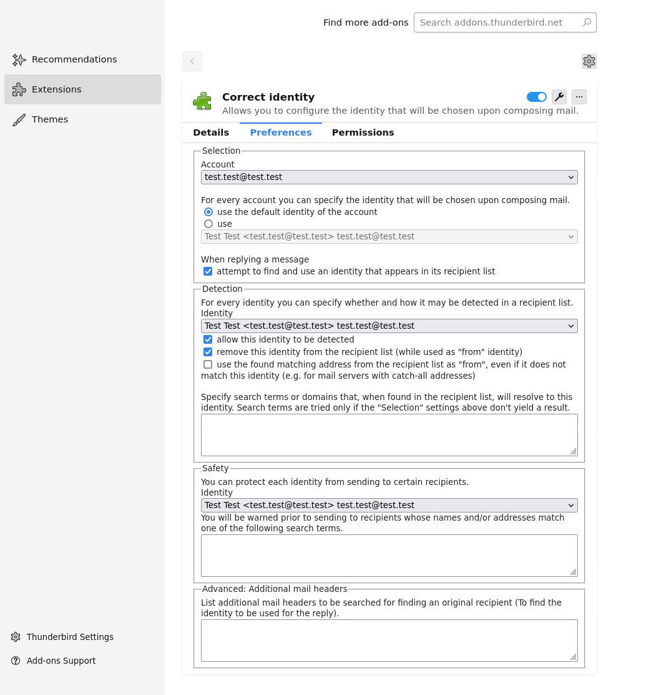

Thunderbird Add-on "Correct Identity" (V2.1.x)
==============================================

This add-on version works with Thunderbird versions >= 91.3.1.
The previous version V2.0.1 supported Thunderbird version >= 78.0

It's a **perfect alternative/continuation**

- of the original (version 1.x.x) Correct Identity
- to [Flexible Identity](https://github.com/snakelizzard/flexible_identity)

which don't work anymore because Thunderbird switched to new Plugin API
framework called [WebExtension](https://webextension-api.thunderbird.net/).

The add-on comes in 5 different languages. Here is a screenshot of the settings
window:

Installation
------------

This add-on update is **not** yet available at the [official Thunderbird add-on store](https://addons.thunderbird.net/), but will be avialable soon on the update channel (https://addons.thunderbird.net/de/thunderbird/addon/correct-identity/).

Steps for installation (local build):
1. Download this repository
2. In the repository folder, execute `./make_xpi.sh` to create an .xpi file
4. Open Thunderbird, go to /Add-ons/, and click /Install add-on from file/
5. Choose the .xpi file in the repository folder

The .xpi files come in two flavours:
* correct_identity_vX.Y.Z.xpi is a version which could (in theory) be released to the [official Thunderbird add-on store](https://addons.thunderbird.net/)
* correct_identity_vX.Y.Z_dev.xpi has the same content, but has no limitation on the highest supported Thunderbird version ("strict_max_version"). Use this version to test this add-on on newer Thunderbird versions not known at date of the add-on release. (Feedback welcome).

The add-on can now be configured in the add-on manager tab.

Alternatively you can directly download an .xpi file from the "Releases" section.

Development & Contributing
--------------------------

1. Fork this repo and download it with `git pull`
2. Call `./make_xpi.sh` in the repo
3. In Thunderbird, Menu /Extras/ → /Development Tools/ → /Debug Add-ons/
4. /Load temporary Add-on/ and select the .xpi file
5. Then you can press /Reload/
6. …
7. Send us a pull request!

Note that you have to generate a .xpi file *with the same name* whenever you change the source code. You can use a file watcher like inotify to automate this.

In Menu /Extras/ → /Development Tools/ you'll also find a dev console and more debugging tools.

Acknowledgment
--------------

Many thanks to @dennisverspuij, the original author , and to @ldreier who ported this add-on to Thunderbird 67!

Trivia
------

Before this fork:

[Here is the old version](https://addons.thunderbird.net/de/thunderbird/addon/correct-identity/versions/1.4.7)
of Correct Identity which doesn't work on Thunderbird versions > 67.
